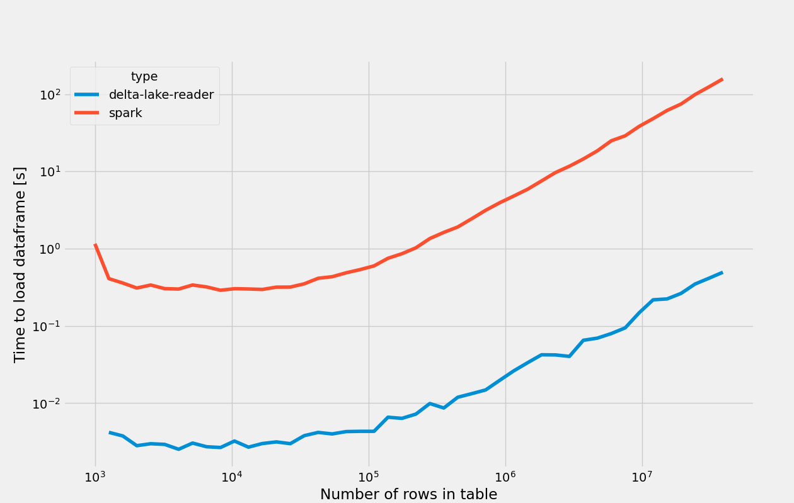

[](https://pepy.tech/project/delta-lake-reader)
# Delta Lake Reader
The [Delta](https://github.com/delta-io/delta) format, developed by Databricks, is often used to build data lakes or lakehouses.

While it has many benefits, one of the downsides of delta tables is that they rely on Spark to read the data. This might be infeasible, or atleast introduce a lot of overhead, if you want to build data applications like [Streamlit](https://www.streamlit.io/) apps or ML APIs ontop of the data in your Delta tables. 

This package tries to fix this, by providing a lightweight python wrapper around the delta file format, **without** any Spark dependencies

# Installation
Install the package using pip


```
pip install delta-lake-reader
```
This will only install the minimal dependencies for working with local file system.
To access Delta Tables stored in popular cloud storages, use one of the following commands, to include the cloud specific dependencies

### Azure
```
pip install delta-lake-reader[azure]
```
### Amazon Web Services (AWS)
```
pip install delta-lake-reader[aws]
```
### Google Cloud Platform (GCP)
```
pip install delta-lake-reader[gcp]
```
# Usage
Package is build on [PyArrow](https://arrow.apache.org/docs/python/) and [FSSpec](https://filesystem-spec.readthedocs.io/en/latest/index.html).

This means that you get all the features of PyArrow, like predicate pushdown, partition pruning and easy interoperability with Pandas.

Meanwhile, FSSpec serves as a FileSystem agnostic backend, that lets you read files from many places, including popular cloud providers.

To read a DeltaTable, first create a `DeltaTable` object.
This will read the delta transaction log to find the current files, and get the schema. This will, however, **not** read any data.
To read the content of the table, call `to_table()` to get a `pyarrow.Table` object, or `to_pandas()` to get a `pandas.DataFrame`
## Local file system

```python
from deltalake import DeltaTable

# native file path. Can be relative or absolute
table_path = "somepath/mytable"

# Get table as pyarrow table
df = DeltaTable(table_path).to_table()

# Get table as pandas dataframe
df = DeltaTable(table_path).to_pandas()
```
## Azure
The Azure integration is based on [adlfs](https://github.com/dask/adlfs) package, developed by the [Dask](https://dask.org/) community.


`credential` used to authenticate against the storage account, can be either a SAS token, Access Keys or one of the `azure.identity` classes. See [authentication using Azure SDK](https://docs.microsoft.com/en-us/python/api/azure-storage-blob/azure.storage.blob.aio.blobserviceclient?view=azure-python#parameters) for more information.

```python
from deltalake import DeltaTable
from adlfs import AzureBlobFileSystem

#example url  'abfss://myContainer@myStorageAccount.dfs.core.windows.net/somepath/mytable'
fs = AzureBlobFileSystem(
        account_name="myStorageAccount", 
        credential='...'
    )
df = DeltaTable("mycontainer/somepath/mytable", file_system=fs).to_pandas()

```

## Amazon Web Service (AWS)
The AWS integration is based on [s3fs](https://s3fs.readthedocs.io/en/latest/) package, developed by the [Dask](https://dask.org/) community. 

To authenticate you can either specify the access key and secret, or since it's build on `boto`, use one of their methods for authentication. See [authentication using AWS SDK ](https://boto3.amazonaws.com/v1/documentation/api/latest/guide/credentials.html) for more information.

```python
from deltalake import DeltaTable
from s3fs import S3FileSystem

#example url  's3://myBucket/somepath/mytable'
fs = S3FileSystem() #authenticate using environment variables, in this example
df = DeltaTable("myBucket/somepath/mytable", file_system=fs).to_pandas()

```

## Google Cloud Platform (GCP)
The GCP integration is based on the [gcsfs](https://gcsfs.readthedocs.io/en/latest/), developed by the [Dask](https://dask.org/) community.

For more information about authentication with GCP see the [gcsfs documentation](https://gcsfs.readthedocs.io/en/latest/#credentials) or the [GCP documentation](https://cloud.google.com/docs/authentication)

```python
from deltalake import DeltaTable
from gcsfs import GCSFileSystem

#example url  'gs://myBucket/somepath/mytable'
fs = GCSFileSystem() #authenticate using environment variables, in this example
df = DeltaTable("myBucket/somepath/mytable", file_system=fs).to_pandas()

```

# Time travel
One of the features of the Delta format, is the ability to do [timetravel](https://docs.delta.io/0.3.0/delta-batch.html#query-an-older-snapshot-of-a-table-time-travel).

This can be done using the `as_version` method. Note that this currenly only support specific version, and not timestamp.
```python
from deltalake import DeltaTable

df = DeltaTable("somepath/mytable").as_version(5).to_pandas()
```
Timetraveling to a version that has been vacuumed, currently results in undefined behavior


# Predicate Pushdown, Partition Pruning & Columnar file formats
Since the resulting `DeltaTable` is based on the `pyarrow.DataSet`, you get many cool features for free. 

The `DeltaTable.to_table` is inherited from `pyarrow.Dataset.to_table`. This means that you can include arguments like `filter`, which will do partition pruning and predicate pushdown. If you have a partitioned dataset, partition pruning can potentially reduce the data needed to be downloaded substantially. The predicate pushdown will not have any effect on the amount of data downloaded, but will reduce the dataset size when loaded into memory.

Further more, since the underlying parquet file format is columnar, you can select a subset of columns to be read from the files. This can be done by passing a list of column names to `to_table`.

See documentation of [to_pandas](https://arrow.apache.org/docs/python/generated/pyarrow.Table.html#pyarrow.Table.to_pandas), or [to_table](https://arrow.apache.org/docs/python/generated/pyarrow.dataset.FileSystemDataset.html#pyarrow.dataset.FileSystemDataset.to_table) for documentation of all arguments

```python
import pyarrow.dataset as ds

#Predicate pushdown. 
#If the table is partitioned on age, it will also to partition pruning
df = DeltaTable("...").to_table(filter=ds.field("age")>=18).to_pandas()

#Only load a subset of columns
df = DeltaTable("...").to_table(columns=["age","name"]).to_pandas()

```

[Read more about filtering data using PyArrow](https://arrow.apache.org/docs/python/dataset.html#filtering-data)


# Bring Your Own Filesystem
Since the implementation is using the FSSpec for filesystem abstraction, you can in principle use any FSSpec filesystem. [See more about available FSSpec interfaces](https://filesystem-spec.readthedocs.io/en/latest/api.html#built-in-implementations).

```python
fs = SomeFSSpecFilesystem()
df = DeltaTable(path, file_system=fs).to_pandas()
```

# Performance comparison with PySpark
It is possible to run `PySpark` in local mode, which means you can run spark code without having to spin up an entire cluster. This, however, still involves a big performance and resource usage overhead. To investigate if this module is actually faster than using `PySpark` i made a small experiment. 

The time to read a table into a pandas dataframe was measured for a table with 3 columns, and various number of rows. 
The tables were stored locally on a VM (8 vCPUs, 32GB ram). This might be a synthetic test case since you normally would store your table in a remote blob store, where network latency would even out the results a bit. `PySpark` was, however, still given an advantage by first being timed after starting the Spark session, which can take several seconds. Furthermore the resource usage by `PySpark` should be significantly higher, both in terms of CPU and RAM, which can be another limiting factor. Finally, reading data from remote blob storage often requires adding cloud specific JARs to the runtime, which may or may not be tedious to get to work.

The results can be seen below, where `delta-lake-reader` is about 100x faster than `PySpark` on average



## Disclaimer (2021-01-15)
Databricks recently announced a stand alone reader for Delta tables in a [blogpost](https://databricks.com/blog/2020/12/22/natively-query-your-delta-lake-with-scala-java-and-python.html)
The stand alone reader is JVM based, but an "official" Rust implementation with python bindings also exists. Back then the python bindings couldn't be pip installed, which was a major inconvenience for python developers, but this has since been added.
While there is a lot of overlap between these two project, this projects still supports a few additional features, compared to the Rust implemtation, like more alternatives for authenticating to azure (identity based, instead of only relying on account key) and support for more file systems like GCP buckets.
If you, however, are interested in a more actively maintained package, if would recommend taking a look at [the Delta Rust implemtation](
https://github.com/delta-io/delta-rs).
Although the idea for this library was made independently, some inspirations has been taken from the Rust library.


# Read more

[Delta Table paper](https://databricks.com/research/delta-lake-high-performance-acid-table-storage-overcloud-object-stores)

[Delta transaction log](https://databricks.com/blog/2019/08/21/diving-into-delta-lake-unpacking-the-transaction-log.html)

[PyArrow Documentation](https://arrow.apache.org/docs/index.html)

[FSSpec Documentation](https://filesystem-spec.readthedocs.io/en/latest/)

